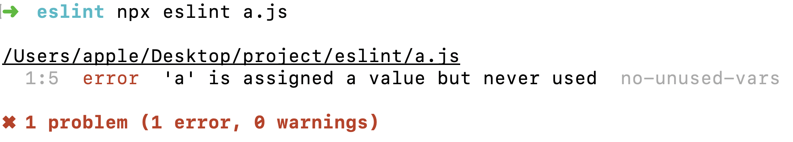
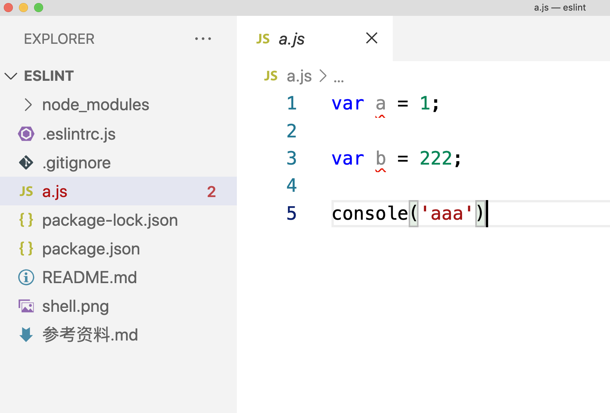
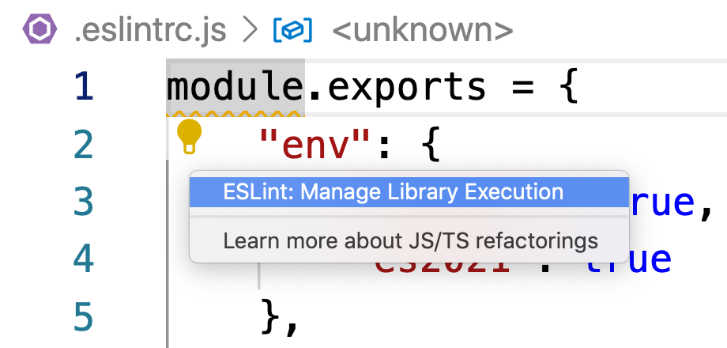
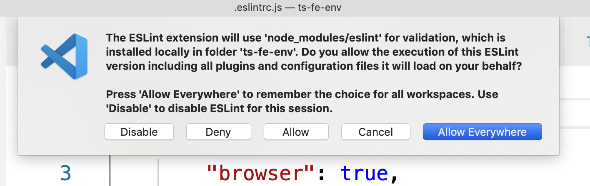

# ESLint
eslint的基本逻辑我都懂，就是不知道如何配置检查环境。

eslint有三种检查时机：
- 直接使用eslint命令在命令行测试
- 编写代码是即时提醒，需要在代码编辑器中安装插件
- 在git commit的时候强制检查，需要安装特殊命令

### 命令行工具
最基本的，eslint提供了命令行工具，可以帮助我们直接进行代码检查

```sh
$ sudo npm install eslint --save-dev
```

### 配置文件
之后需要配置文件，说明当前项目到底要以什么风格来检查代码

``` sh
$ npx eslint --init
```

自动生成了 .eslintrc.js 文件

### 检查风格
```sh
$ npx eslint a.js
```



```
➜  eslint npx eslint a.js

/Users/apple/Desktop/project/eslint/a.js
  1:5  error  'a' is assigned a value but never used  no-unused-vars

✖ 1 problem (1 error, 0 warnings)
```

### VSCode插件
每次都是在命令行检查实在是不直观，需要使用。

安装 eslint 这个插件就行了。


之前eslint总是没有反应，应该我没有启动设置，需要点击代码旁边的小灯泡：



不过只会检查已经打开的文件。